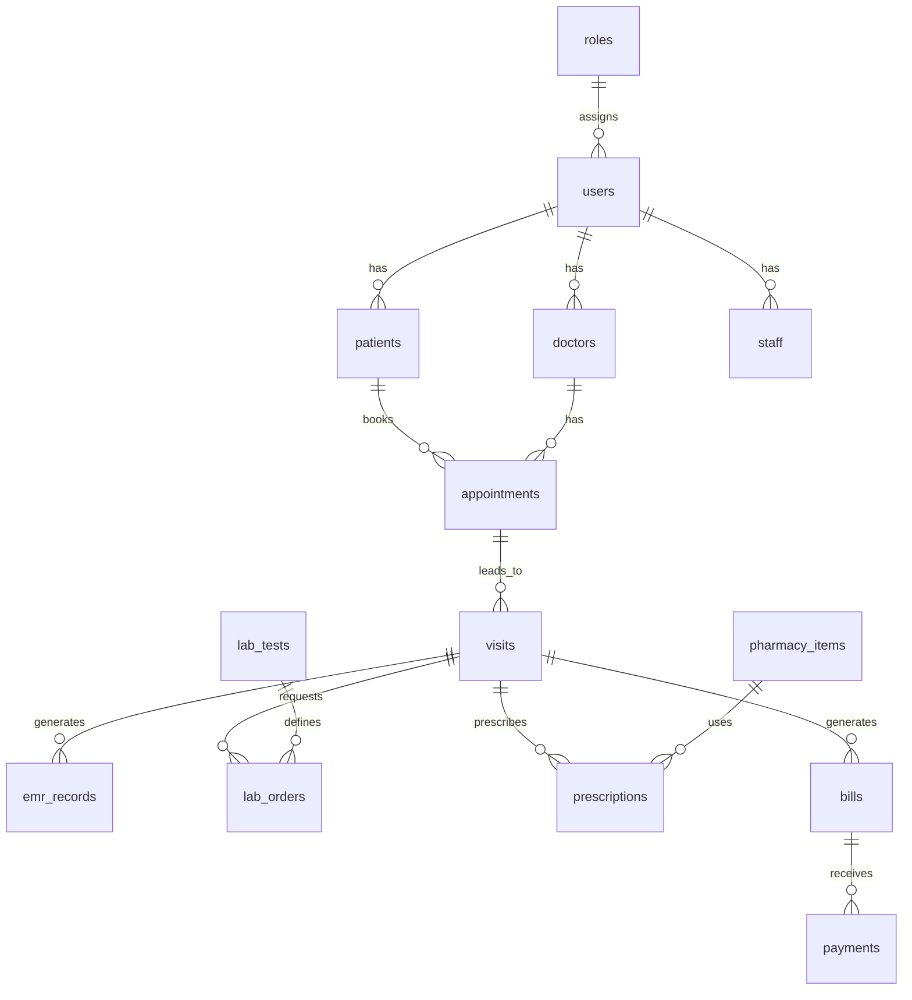

# Hospital Management Software Architecture and Database Schema Plan

## Overview

The Hospital Management Software (HMS) is a comprehensive Laravel-based system designed to manage hospital operations efficiently. It supports Outpatient Department (OPD) and Inpatient Department (IPD) management, patient and staff administration, billing, pharmacy, lab operations, and reporting. The system is modular, scalable, and supports multiple user roles including hospital owners, administrators, doctors, nurses, front desk staff, pharmacists, lab technicians, patients, and IT administrators.

Key features include patient registration, appointment scheduling, electronic medical records (EMR), lab diagnostics, billing with VAT calculations, and compliance reporting. The system will support Bengali and English languages and include SMS notifications.

## System Modules

The application is divided into the following modules for better maintainability and scalability:

1. **User Management**: Handles authentication, authorization, and role-based access control (RBAC). Roles include Admin, Doctor, Nurse, Front Desk, Pharmacist, Lab Tech, Patient, IT Admin.

2. **Patient Management**: Manages patient registration, profiles, and demographics.

3. **Doctor/Staff Management**: Manages doctor and staff profiles, specializations, and schedules.

4. **Appointment & Queue Management**: Handles appointment booking, queue management, and scheduling.

5. **OPD Management**: Manages outpatient visits, consultations, and workflows.

6. **IPD Management**: Future module for inpatient ward management, admissions, and discharges.

7. **EMR Management**: Electronic Medical Records for storing diagnoses, prescriptions, and medical history.

8. **Lab & Diagnostic Management**: Manages lab tests, orders, results, and diagnostics.

9. **Pharmacy Management**: Handles inventory, prescriptions, and dispensing.

10. **Billing & Accounts**: Manages billing, payments, VAT calculations, and financial reporting.

11. **Reporting & Compliance**: Generates reports for operations, compliance, and analytics.

12. **Notification System**: Handles SMS notifications for appointments, results, and reminders.

## Database Schema

The database uses MySQL/PostgreSQL for production (SQLite for development). Key entities and their attributes:

- **users**: id, name, email, password, role_id, phone, address, language_preference, created_at, updated_at
- **roles**: id, name (e.g., admin, doctor)
- **patients**: id, user_id, date_of_birth, gender, address, emergency_contact, medical_history
- **doctors**: id, user_id, specialization, license_number, department
- **staff**: id, user_id, department, shift, salary
- **appointments**: id, patient_id, doctor_id, appointment_date, status (pending, confirmed, completed), notes
- **visits**: id, patient_id, doctor_id, appointment_id, visit_type (OPD/IPD), visit_date, status
- **emr_records**: id, visit_id, diagnosis, prescription, notes, attachments
- **lab_tests**: id, name, description, price, normal_range
- **lab_orders**: id, visit_id, lab_test_id, result, status (ordered, completed), ordered_at, completed_at
- **pharmacy_items**: id, name, description, price, stock_quantity, expiry_date
- **prescriptions**: id, visit_id, pharmacy_item_id, quantity, dosage, dispensed
- **bills**: id, patient_id, visit_id, total_amount, vat_amount, discount, status (unpaid, paid, partial)
- **payments**: id, bill_id, amount, payment_method, transaction_id, paid_at

## ER Diagram

## API Endpoints

The system exposes RESTful APIs for integration with frontend or external systems. Key endpoints:

- **Authentication**: POST /api/login, POST /api/register, POST /api/logout
- **Patients**: GET /api/patients, POST /api/patients, GET /api/patients/{id}, PUT /api/patients/{id}
- **Appointments**: GET /api/appointments, POST /api/appointments, PUT /api/appointments/{id}/status
- **Visits**: GET /api/visits, POST /api/visits, GET /api/visits/{id}/emr
- **Lab Orders**: POST /api/lab-orders, PUT /api/lab-orders/{id}/result
- **Bills**: GET /api/bills, POST /api/bills, PUT /api/bills/{id}/pay
- **Reports**: GET /api/reports/patient-summary, GET /api/reports/financial

APIs use JWT for authentication and return JSON responses.

## Module Integration and Architecture

The architecture follows Laravel's MVC pattern with modular service providers. Each module has its own controllers, models, and services.

- **Integration**: Modules communicate via events (e.g., AppointmentCreated event triggers SMS notification) and dependency injection.
- **Frontend**: Uses Blade templates or API-driven SPA (e.g., Vue.js).
- **Queue System**: For background jobs like report generation and SMS sending.
- **Caching**: Redis for performance.
- **Security**: Role-based middleware, input validation, CSRF protection.

## Additional Requirements

- **Multilingual Support**: Laravel localization with files in resources/lang/en and resources/lang/bn.
- **SMS Notifications**: Integrate with Twilio or similar via Laravel notifications and events.
- **VAT Calculations**: In billing module, calculate VAT based on configurable rates (e.g., 15% on services).

## Technical Specifications

- **Framework**: Laravel 12
- **Database**: MySQL/PostgreSQL
- **PHP**: 8.2+
- **Frontend**: Blade/Vue.js
- **Deployment**: Docker, CI/CD with GitHub Actions
- **Testing**: PHPUnit for unit/integration tests
- **Documentation**: API docs with Swagger/OpenAPI